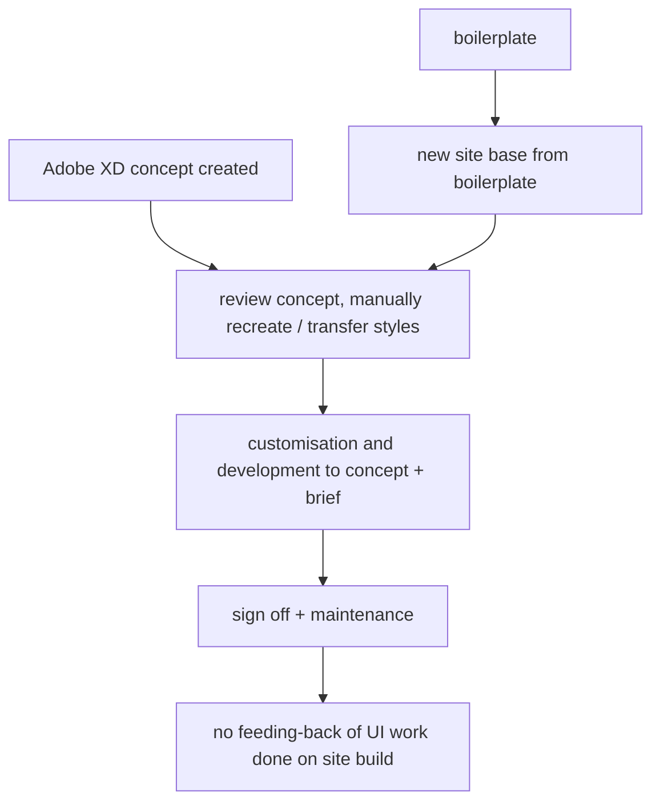
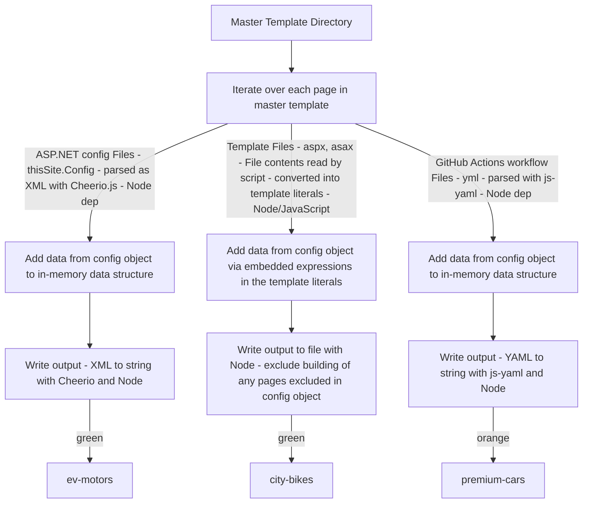

Article 1 - Bluesky Elements

Intro:
I created a new Front End Design and Development workflow. I designed and built a suite of new tools and processes that drastically improved front-end development times, and designer - developer handoff.

Impact:
- Front End Development times cut by 50% for custom site builds eg smaller site build was a 4-week process roughly, now 2 weeks.
- Previously approximately one day of Front End Developer time was being spent per site, transferring design values, and exporting assets from a Designer's concepts. The process now takes approximately 30 minutes of Designer time, with the integration of those design tokens into a new site's codebase now being consistent and predictable.

High-level summary of Activities :
- Developed a new library for the creation of browser-native Web Components, powered by Petite Vue (Vue.JS).
- Developed a large in-house UI component library, featuring a wide-range of components for rapid development.
- Closely collaborated with UX/UI Designers to create a standardised design system, now used as the backbone for both concepts created in Figma, and for Front End Development.
- Created a new tooling in the form of a Web App, allowing UX/UI Designers to easily submit design token values as JSON to a remote database.
- Created a Node CLI used by the Front End Development team at the start of a new build project. This tool automates the process of updating SCSS modules, and Bootstrap variables, with design token values.
- Personally validated the new tools and processes by building client sites to new target timeframes ahead of wider team roll-out.
- Trained Front End team members in the use of the new system, processes, and tooling. This included introducing pair programming, for the first time, to the site build process.

Problem & Background – Explain the technical challenge.
The business was struggling to deliver custom sites to clients quickly enough. This was causing problems in terms of managing the backlog of custom site builds. This, in turn, was affecting client relationships and, ultimately, contract renewal.

While the business had invested in creating a boilerplate codebase to speed up Front-End Development, each build required significant amounts of time to customise this in such a way as to realise the concepts provided by the in-house UX/UI Designers.

Each site being designed and developed without reference to a consistent design system, also led to a significant maintenance burden, because of the idiosyncratic way each site was built on top of the boilerplate by each developer.

The business uses a legacy ASP.NET stack for site development.  The codebase is split into two distinct parts. One set of files, referred to internally as 'Vanilla', handle server-side / business logic. This part of the codebase is maintained by the Back-End team.  The other part of a site's core codebase, is made up primarily of template files, SCSS, client side JavaScript, and build tooling. This is maintained by the Front-End team.

The only vehicle for moving somewhat towards a component model within the constraints of the existing system would have been to create new Server Controls. The creation of custom Server Controls, however, had traditionally lay with the Back-End Team, and existing custom Server Controls were defined in the 'Vanilla' files, rather than within the Front End 'boilerplate' codebase.

As the role of front end development changed over the years, there was a difficulty in making use of more modern patterns, and related technologies. The general sentiment within the Front End team was that the team was at an impasse - "we want to use more modern technologies and approaches but we can't because we have to use the legacy ASP.NET stack". This led to a period of frustration within the Front End team, and in some sense stagnation in terms of keeping abreast with newer technologies and approaches to Front End Development.

In summary, the problems were: lengthy builds, a lack of systematisation in build processes, a lack of collaboration between Design and Front End, feelings of being stuck with legacy technology in the context of rapid change in the industry, and high maintenance burdens due to idiosyncrasies in how sites were built.

Initial State & Constraints – What made it tricky?
- Team inexperienced in using newer technologies, or approaches to UI Development such as declarative programming, and reactivity.
- Not purely a technical challenge. Success required more than simply building the tools mentioned above. It required thinking through how to best support Designers and FE Devs in using the new tools and processes in their day to day work. This touched on training needs, issues of confidence and motivation, and building understanding.
Helping the business's Designers understand, and work from, a new component-first, and design-system-based approach.

Architecture & Process Changes

Deep Dive – Focused breakdown of critical parts
- Front End Development - system overview
- Bluesky Elements UI Library core - make this a focus
- Design tokens Web App and CLI - diagram this out

Performance & Maintainability Gains – Measurable impact.
- Team are now consistently delivering sites 50% faster than prior to these changes in process
- Department Head has fedback a much improved quality of Designers' work. Designers are now able to create concepts much more quickly, and with a standardised approach.
- Design team members now use the language of the design system. For example, talking specifically in terms of the agreed spacing and type scales, and using naming conventions of the library of UI components, leading to more clarity in communication between individuals and teams.
- Developers are now able to share components between sites much more easily, reducing the amount of code that needs to be written
- Maintenance burden has been reduced as common component logic, housed in predictable structures and patterns allows for easier updates and roll-outs of bug-fixes.
- Some of the repeated, burdensome, aspects of builds are now fully automated.

Lessons & Best Practices – How this informs future work.
From the outset, the decision to use Petite Vue was made with an eye to both technical and business concerns. In particular, the choice was informed by questions of "How to successfully transition a team used to working with JQuery and Bootstrap to more Front End Development practices?" And "How can this support the business’s longer term goals of modernising both its Front-End and Back-End technologies?"

By choosing a library with a small API, specifically designed for use cases such as progressive enhancement, the Front End team were given an easier move away from JQuery than they would have been with a choice of React or Vue 3. This was important given the lack of prior investment in training for the Front End team. I believe the  'best' technology choices must always be evaluated in context, and that people (users, Developers, teams, etc) must be a fundamental concern, not only a technology's features.

The business is now well positioned to treat custom work on each build as an asset rather than a cost, with components easily re-integrated 'upstream' into the boilerplate codebase.

By utilising Petite Vue at the core of the Web Component library, the business is now well positioned to treat custom work on each build as an asset rather than a cost, with components easily re-integrated 'upstream' into the boilerplate codebase.  It also has a mechanism to take the same approach to its development work at a higher-level : as the business pursues its goal of modernising its core development technology, components in the UI library are able to be easily converted to Vue components. This has allowed for rapid prototyping, as the business moves to API  driven sites, with endpoints managed by the Back-End team, and a new SSG-centric approach, leveraging Astro and Vue 3, by the Front-End team.

