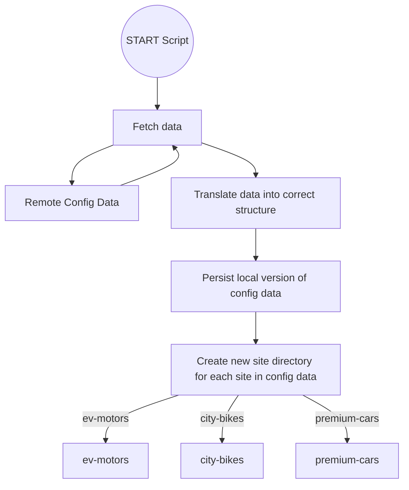
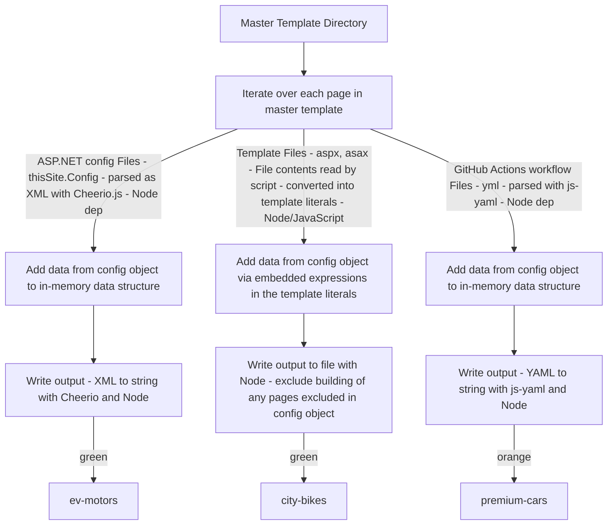

Article 2 - 300 project

Intro:
I created the system design, tooling, and git-based workflows that have allowed the business to create a new offering based on configurable, and customisable, templated sites with zero development time required to build. As part of the project, I created a custom template compiler that has allowed the business to leverage its existing codebase in a completely new way. This tool, and the broader system design I have created, enabled the business to bring a level of flexibility and configurability beyond a standard templated site offering. The tool and system allow for client choices of theme, UI components and layout; and use of brand assets such as unique colours and imagery. The git-based workflows create these sites using modern CI/CD practices including git-based version control, and deployment using Github Actions.

Impact:
- Feedback from the Department Head :that this has been the most successful product development / product delivery he has seen at the business.
- Product managers are now able to spin up sites within minutes, with zero developer input required. The business's only other established development process takes a minimum of 2 weeks of Front End Developer time. With 150 sites live, this represents 300 weeks of developer time saved so far over building with the existing process.
- The template compiler creates unique individual client sites from a single master codebase. This master codebase contains variations in pages, partials, components, theme-styles, and third-party integrations. These are selected on a site by site basis - drawing values from the site config data. Using this method, we can also configure custom rules for including/excluding individual pages from a build.
- This reduces the burden of maintenance considerably over the business's fully custom offering. Working this way allows for consistency of outcome and fast turn-around of bug-fixes and enhancements to all 150 live sites. This scalability is crucial given different market characteristics of these small vehicle dealerships compared with the large clients requiring fully custom websites.
- The success of the tool led to the Back-End team requesting an extension to the codebase to handle deployment of their codebase also.
- The tools and systems I have created have a high degree of flexibility and can deploy Front End, Back End codebase changes (or both) to individual sites, collections of sites, or to all sites. This flexibility allows for fine-grained testing, roll-out, and roll-back of changes, as required.
- The business's maintenance Developers are tasked with closing 8 to 10 maintenance jobs a day. One senior developer trained in how to use the tooling is able to deploy approved changes to between 1 and 150 sites simultaneously. This brings more than an order of magnitude of improved maintenance development productivity.
- The success of the tooling and system design has enabled the business to meet its new contractual obligations as part of the take-over of these client sites.

High-level summary of activities :
- Created the System Design for the new development workflow
- Developed a Node.JS-based custom template compiler, and CLI.
- Developed the master template used within the template compiler.
- Developed the various git-based automated workflows for site generation and deployment
- Presented the system design to department heads from: Ops, Product, Back-End, and Front-End teams.
- Designed data structures, and specced requirements, for the Back End Development team's work
- Worked closely with the Product Manager and Back End team throughout.
 - Trained and supported a senior developer in the use of the tool to extend the master template, add themes, and carry out maintenance.

Problem & Background – Explain the technical challenge.
The business was looking to branch out into a new area of its market to open up a new revenue stream. As part of this the business had agreed to take over the management of 300 car dealership websites from another business who was looking to unburden themselves of that work, finding they were unable to manage the workload required to effectively create and maintain the sites.
The business has traditionally positioned itself as an agency that creates custom websites for clients, and had no experience in templated site offerings. These sites would need to have differentiating features such as brand colours and typography, have options for different layouts, and UI components. They would also need to have options for variations in core functionality such as searching and filtering vehicle stock, and integrating different vehicle finance providers. In short, the solution would need to be able to produce sites with a reasonable amount of variation in design and functionality from one site to the next, while still being scalable if the new business were to be profitable.

All sites would also need to be able to work with the existing back-end and front-end codebases, with the existing headless CMS, which were not designed to be used in a templated site offering. The business had been won on the basis of a very fast turn-around in delivering the first of these sites. While the business won created an opportunity in terms of the new revenue stream, it had also created a new problem: how would the business would be able to deliver on the new contractual obligations to the time-frame with its current technology?  Anxiety about this was shared in several team meetings prior to my presentation of this system design.

Initial State & Constraints
- A need to deliver within the constraints of the existing codebase - both front end and back-end team's.
- No initial ideas about how to approach the problem, and no experience in templated site offerings.
- Very quick turn-around required for the first sites.

Architecture & Process Changes

### Diagram 1

### Diagram 2

Performance & Maintainability Gains – Measurable impact.
- New sites now delivered in minutes without any developer involvement.
- All 150 live sites are now able to be maintained by a single trained developer
- 150 sites represents approximately £72,000 per year in new revenue. The system is able to accommodate all 300 sites the business is in the process of moving over, which will represent more than £144,000 per year of additional revenue if all are brought over.
- Extremely low per-site site maintenance costs, leading to significantly higher per-site profit margins on this new revenue stream than would be if having to use existing manual site development and maintenance processes.

Lessons & Future Work.
The business is early in the process of moving to new Back End and Front End codebases. This will be an API-driven Back End. The Front End solution will use Astro.JS for Static Site Generation. The lessons learnt on this project are extremely relevant to the new SSG approach this business is moving to for its Front End Development. The basic system of leveraging a master codebase, and generating unique sites at build-time based on configuration data, creates a highly scalable web design solution. This is also possible in the context of Static Site Generation, with a Framework like Astro.

By Integrating the learning from this successful project with the latest codebase, I have been able to open up a new opportunity: creating a new higher-quality product marketable at a higher price-point with the significant efficiency improvements, and cost savings, of the new development workflow. I am currently working with other members of the business to develop a premium offering based around this model.

Any level of customisation required to meet designs will still be accommodated in this new premium offering. In the context of these configurable sites, new components, layouts, etc are created  'upstream' of any single site build. Bespoke development time will then, first, be spent building an upstream business asset instead of downstream of the site build. This optimises for reusability. Each time bespoke work extends the master template, it creates further leverage. This is in contrast with the existing development model, in which any work necessary to realise a custom design is always a business cost.

